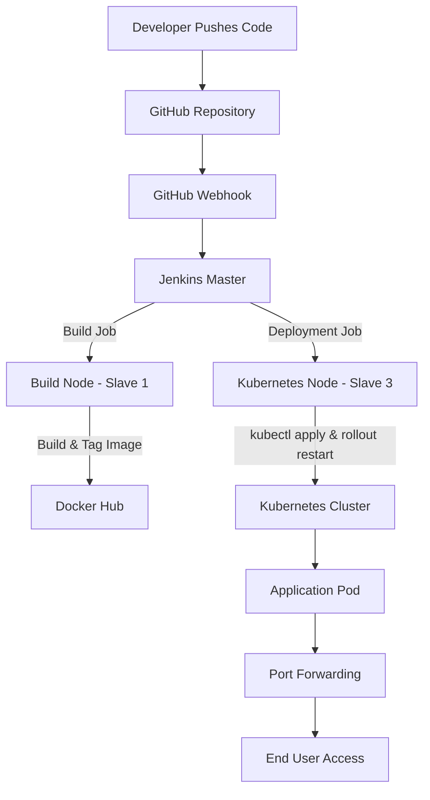

# Project Title: Automated CI/CD Pipeline for Orchestrated Deployments with Jenkins and Kubernetes

**Author:** Abhay Kumar Saini  
**Date:** August 19, 2025  
**Version:** 1.0  

---

## 1. Project Goal & Objectives

This project builds upon a foundational CI/CD pipeline that deployed a single Docker container. The primary goal was to evolve this process by introducing a container orchestration layer with Kubernetes. This transition addresses the limitations of a single-container deployment, such as lack of scalability and resilience.

### Key Objectives
- **Automate Deployment to Kubernetes:** Create a fully automated pipeline that deploys a web application as a pod within a Kubernetes cluster.  
- **Achieve High Availability:** Leverage Kubernetes' self-healing capabilities to ensure the application automatically recovers from crashes.  
- **Enable Scalability:** Build a system where the application can be easily scaled to handle increased traffic.  
- **Implement a Zero-Touch Workflow:** Ensure the entire process, from a git push to a live production update, requires no manual intervention.  
- **Document and Resolve Real-World Challenges:** Identify and solve common technical hurdles related to resource management, networking, and caching in a cloud-based Kubernetes environment.  

---

## 2. Final Architecture & Technology Stack

The project resulted in a three-stage, fully automated pipeline.

 ### System Architecture (Diagram)

### Technology Stack
- **CI/CD Orchestration:** Jenkins (Master-Slave Architecture)  
- **Containerization:** Docker & Docker Hub  
- **Container Orchestration:** Kubernetes (via Minikube)  
- **Cloud Provider:** Amazon Web Services (AWS)  
- **Infrastructure:** 3 EC2 Instances (1 Master, 2 Slaves)  
- **Source Control:** Git & GitHub  

---

## 3. Challenges & Strategic Resolutions

This project involved overcoming several significant, real-world technical challenges. The strategies used to resolve them are a core part of this documentation.

### Challenge 1: Insufficient Cloud Resources
- **Problem:** The initial attempt to set up Minikube on a free-tier AWS EC2 `t2.micro` instance failed because Minikube requires at least **2 CPU cores**.  
- **Resolution:** Upgraded the instance to `t2.medium`, which provided the necessary resources for the Kubernetes cluster to start.  

---

### Challenge 2: Jenkins Agent and Java Version Mismatch
- **Problem:** Jenkins master required **Java 17**, but the Kubernetes slave node had an older Java version, resulting in `UnsupportedClassVersionError`.  
- **Resolution:** Installed `java-17-amazon-corretto` on the slave node, ensuring compatibility.  

---

### Challenge 3: Exposing the Kubernetes Service to the Internet
- **Problem:** Application pod was running but inaccessible from the internet (`ERR_CONNECTION_REFUSED`), even with correct AWS firewall rules.  

**Failed Strategies:**  
- **NodePort:** Did not open the port on EC2’s main network interface.  
- **minikube tunnel:** Failed in cloud VM environments.  

**Successful Strategy:**  
- Used `kubectl port-forward --address='0.0.0.0'` to create a robust tunnel from EC2 to the application pod.  

---

### Challenge 4: Application Not Updating After Successful Deployment
- **Problem:** Website continued showing old content after pipeline execution.  
- **Analysis:** Kubernetes caching issue due to using the `latest` tag.  
- **Resolution:** Added `kubectl rollout restart deployment my-web-app` to Jenkins deployment script, forcing a rolling update and pulling the fresh image.  

---

## 4. Final CI/CD Strategy

The final, successful strategy incorporates lessons learned:

- **Image Tagging:** Each build produces two tags → `:build-number` (e.g., `:14`) for traceability, and `latest` for deployment.  
- **Deployment Trigger:** GitHub webhook triggers pipeline on every git push.  
- **Deployment Update:** Uses `kubectl apply` + `kubectl rollout restart` to ensure new image is always deployed.  
- **External Access:** Application exposed reliably with `kubectl port-forward`.  

---

## ✅ Conclusion
This project successfully demonstrates a **mature, resilient, and fully automated CI/CD pipeline** leveraging Kubernetes for modern application deployment.
